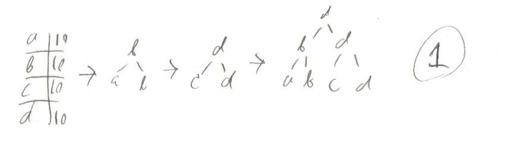
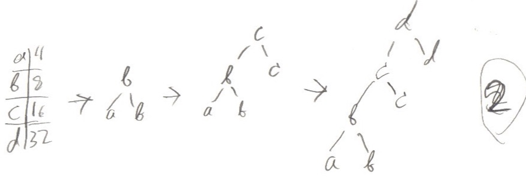

- - - - -
1.1: I built the tree using the algorithm with the conventions used on the in-class worksheet. 
1.2: To find the codeword, write down the path from the root to the node in 1's and 0's.
1.3: 
1.4-6: No difference 

- - -- -

2.1: I built the tree using the algorithm with the conventions used on the in-class worksheet. 
2.2. To find the codeword, write down the path from the root to the node in 1's and 0's.
2.3: 
2.4-6: No difference 
